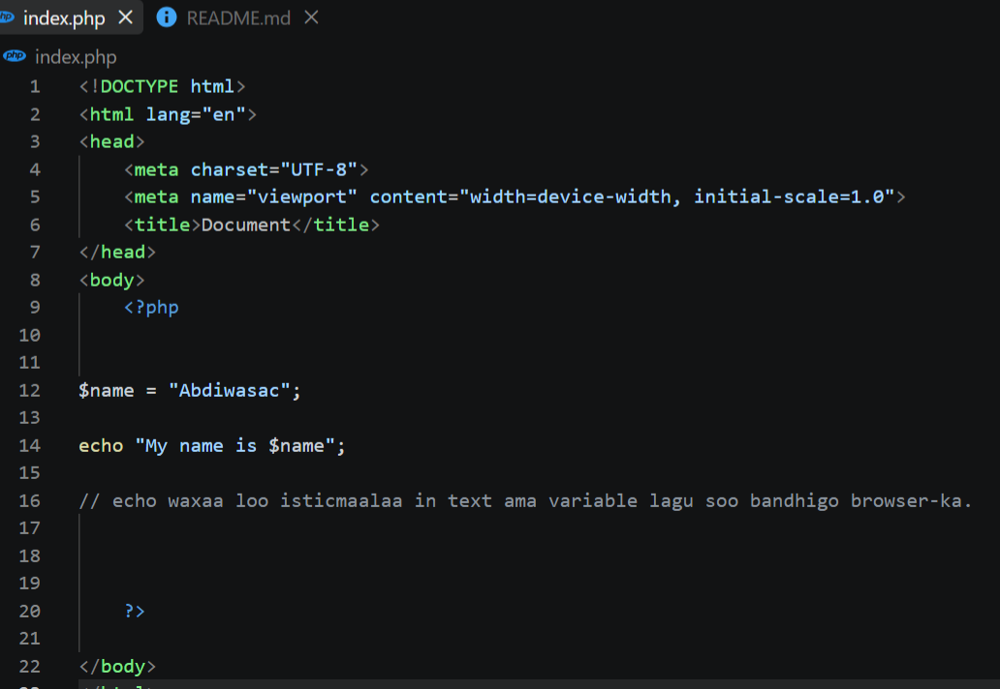
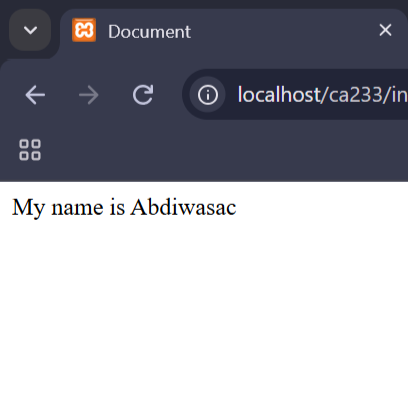
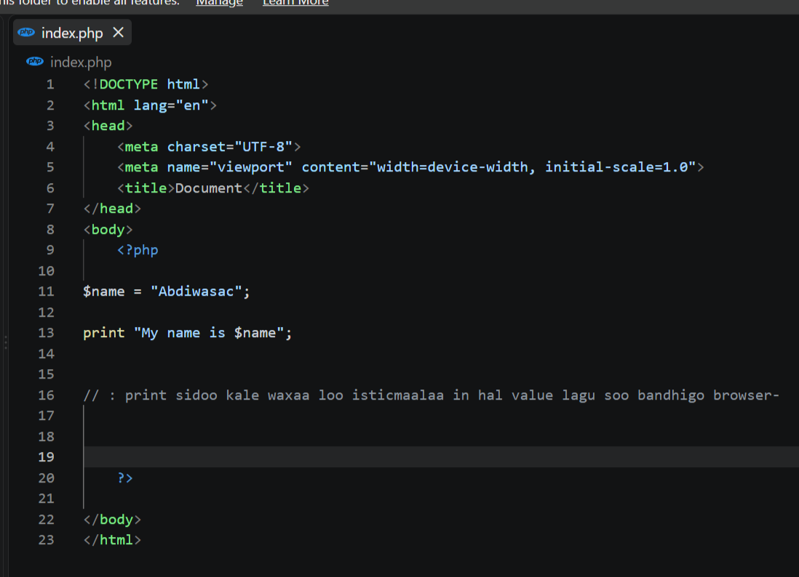

# 1. Outputting Variable with `echo`

## Screenshot Name

`image.png`

## Description

This screenshot demonstrates declaring a string variable and outputting its value using double-quoted string interpolation with the `echo` statement.

Main concepts covered:

- Variables are defined using the `$` symbol (`$name = "Abdiwasac";`).
- The `echo` construct evaluates variables directly inside double quotes and sends the resulting text to the browser.

Example Code:

```php
<?php
$name = "Abdiwasac";
echo "My name is $name";
// echo waxaa loo isticmaalaa in text ama variable lagu soo bandhigo browser-ka.
?>
```

## Screenshot



---

# 2. Browser Output for `echo` and `print`

## Screenshot Name

`output.png`

## Description

This screenshot demonstrates the rendered browser output when displaying a string interpolated with a variable using `echo` or `print`.

Main concepts covered:

- The server parses the PHP code and renders the string `My name is Abdiwasac` directly into the web document.
- Both `echo` and `print` produce identical visible results in the browser for simple string output.

Example Code:

```php
<?php
$name = "Abdiwasac";
echo "My name is $name";
?>
```

## Screenshot



---

# 3. Outputting Variable with `print`

## Screenshot Name

`code.png`

## Description

This screenshot demonstrates displaying a string variable using the `print` statement with inline variable interpolation.

Main concepts covered:

- `print` functions similarly to `echo` for sending data to the web browser.
- Double-quoted strings allow variable evaluation directly within the printed string.

Example Code:

```php
<?php
$name = "Abdiwasac";
print "My name is $name";
// print sidoo kale waxaa loo isticmaalaa in hal value lagu soo bandhigo browser-ka
?>
```

## Screenshot



---

# 4. String Word Count Function (`str_word_count`)

## Screenshot Name

`code counter function.png`

## Description

This screenshot demonstrates counting and displaying the total number of words in a given string using PHP's built-in `str_word_count()` function.

Main concepts covered:

- `str_word_count()` analyzes string values and counts distinct words separated by spaces.
- For the test string `'abdiwasac abdulkadir omar'`, the function evaluates 3 words and outputs `3`.

Example Code:

```php
<?php
$my_str = 'abdiwasac abdulkadir omar';
echo str_word_count($my_str);
// Waxay tirisaa tirada erayada.
?>
```

## Screenshot

)

---

# 5. Browser Output for Word Count (`str_word_count`)

## Screenshot Name

`outout of counter.png`

## Description

This screenshot demonstrates the browser output generated when running the `str_word_count()` function on a string variable.

Main concepts covered:

- The function calculates the word total on the server side and outputs a raw integer to the browser.
- The resulting browser output displays `3` for the string containing three words.

Example Code:

```php
<?php
$my_str = 'abdiwasac abdulkadir omar';
echo str_word_count($my_str);
?>
```

## Screenshot

)

---

# 6. String Length Function (`strlen`)

## Screenshot Name

`function of strilen.png`

## Description

This screenshot demonstrates calculating the overall character count of a string variable using the `strlen()` function.

Main concepts covered:

- `strlen()` returns the total character length of a string, including letters, numbers, spaces, and special characters.
- For the test string `'abdiwasac abdulkadir omar'`, the total length including spaces equals `25`.

Example Code:

```php
<?php
$my_str = 'abdiwasac abdulkadir omar';
echo strlen($my_str);
// Waxay tirisaa tirada characters-ka string-ka, oo ay ku jiraan spaces-ka.
?>
```

## Screenshot

>))

---

# 7. Browser Output for String Length (`strlen`)

## Screenshot Name

`output of strilen.png`

## Description

This screenshot demonstrates the browser output displayed after executing PHP's `strlen()` function.

Main concepts covered:

- `strlen()` computes the exact character count of the string and returns an integer.
- The web browser renders `25` representing the full character length including whitespace characters.

Example Code:

```php
<?php
$my_str = 'abdiwasac abdulkadir omar';
echo strlen($my_str);
?>
```

## Screenshot

)